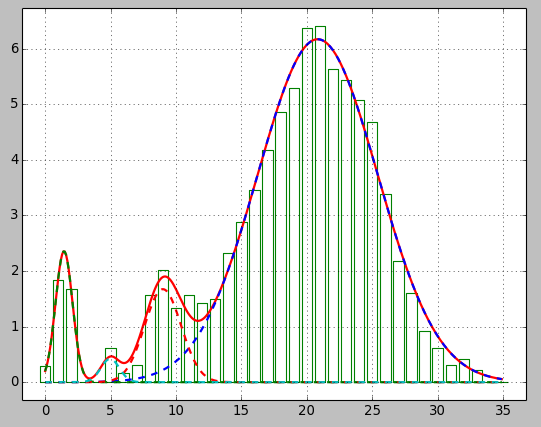

# gaussfit
Program to fit multiple gausses to data

To fit multiple gausses to a data file first one should prepare file with fitting parameters: start values and fitting range.
Here is an explained example from `data.fit`:

~~~
# First gauss
x0  A  s
|   |  |
v   v  v
25  4  5      <-- guess value
20  0  0      <-- lower fitting bound
28  8  10     <-- upper fitting bound
~~~

where `x0` is expectation value, `A` is amplitude, `s` is gauss width.

Program by default is doing fitting from file 'data.txt' and taking parameters from 'data.fit', to do fitting from any data `datafile` and parameters `parafile`:

~~~
python fitgauss.py datafile parafile 
~~~

By third argument user can specify `log` file:

~~~
python fitgauss.py file parafile log
~~~

Requirements:
* `Python 2.7`
* `SciPy 0.18.1`
* `Matplotlib 1.3.1` 
